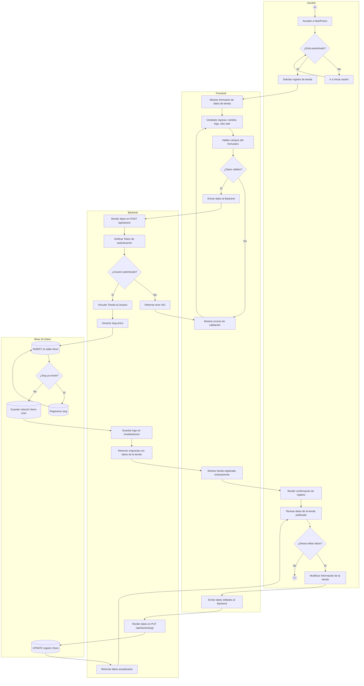
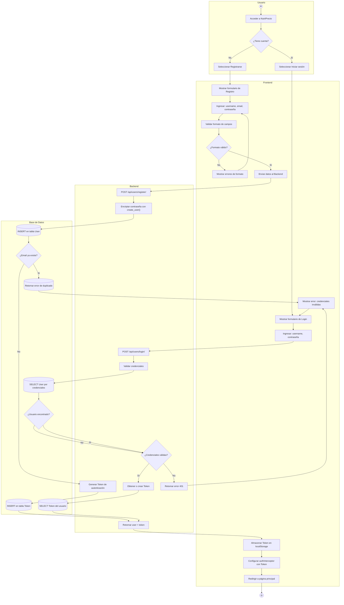
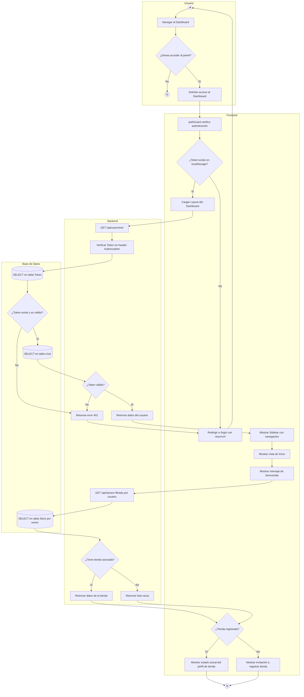

# Diagrama de Actividades — NutriPrecio

## 1. Descripción

Los diagramas de actividades modelan los flujos de trabajo principales del sistema NutriPrecio, basados en las historias de usuario del Sprint Backlog. Se utiliza la notación UML con swimlanes (carriles) organizados en cuatro categorías: **Usuario**, **Frontend**, **Backend** y **Base de Datos**.

---

## 2. Flujo MV-03: Registro de Tienda por Vendedor

> _"Como un vendedor independiente, necesito poder registrar mi tienda o pyme en la plataforma."_

### Descripción del Flujo

| Paso | Categoría | Acción |
|------|-----------|--------|
| 1 | Usuario | Accede a la plataforma y verifica si está autenticado. |
| 2 | Frontend | Muestra el formulario para ingresar datos de la tienda (nombre, logo, sitio web). |
| 3 | Frontend | Valida los campos del formulario antes de enviar. |
| 4 | Backend | Recibe los datos, verifica autenticación y vincula la tienda al usuario. |
| 5 | Base de Datos | Verifica unicidad del slug, crea el registro en Store y la relación Store-User. |
| 6 | Backend | Almacena el logo y retorna los datos de la tienda creada. |
| 7 | Usuario | Revisa los datos publicados y decide si editarlos. |

**Tareas del Sprint asociadas:**
- Backend: Crear tabla en BDD para Perfiles de Tienda vinculada al usuario (Vicente Sepúlveda)
- Frontend: Crear formulario para que el vendedor ingrese datos de su pyme (Benjamín Buzeta)
- Backend: Crear endpoint para recibir y guardar información pública de la tienda (Matías Ramírez)

---

## 3. Flujo MV-52: Registro e Inicio de Sesión

> _"Como un futuro comprador, necesito un login, con la finalidad de poder crear mi cuenta."_

### Descripción del Flujo

| Paso | Categoría | Acción |
|------|-----------|--------|
| 1 | Usuario | Decide si registrarse (nuevo) o iniciar sesión (existente). |
| 2 | Frontend | Muestra el formulario correspondiente y valida el formato de los campos. |
| 3 | Backend (Registro) | Encripta la contraseña con `create_user()` y genera un Token. |
| 4 | Base de Datos | Verifica si el email ya existe; si no, crea registros en User y Token. |
| 5 | Backend (Login) | Valida las credenciales consultando la BDD. |
| 6 | Base de Datos | Busca el usuario por credenciales y verifica si existe. |
| 7 | Frontend | Almacena el Token en localStorage, configura el interceptor y redirige. |

**Tareas del Sprint asociadas:**
- Backend: Configurar la BDD para usuarios y encriptación de contraseñas (Vicente Sepúlveda)
- Frontend: Diseñar interfaz del formulario de Registro e Inicio de Sesión (Fernando Sepúlveda)
- Backend: Desarrollar lógica para validación de credenciales y tokens de sesión (Benjamín Buzeta)

---

## 4. Flujo MV-54: Acceso al Dashboard del Vendedor

> _"Como un vendedor independiente logueado, necesito acceder a un panel de control privado."_

### Descripción del Flujo

| Paso | Categoría | Acción |
|------|-----------|--------|
| 1 | Usuario | Decide si desea acceder al panel de control y solicita acceso. |
| 2 | Frontend | El `authGuard` verifica si existe un Token en localStorage. |
| 3 | Backend | Verifica el Token contra la BDD mediante el header Authorization. |
| 4 | Base de Datos | Valida existencia del Token, consulta User y Store por owner. |
| 5 | Backend | Verifica si el vendedor tiene una tienda asociada. |
| 6 | Frontend | Según si tiene tienda registrada, muestra el perfil o una invitación a registrar. |

**Tareas del Sprint asociadas:**
- Backend: Configurar rutas protegidas para que solo vendedores logueados vean el panel (Vicente Sepúlveda)
- Frontend: Diseñar y maquetar el Layout del Dashboard (Benjamín Buzeta)
- Frontend: Crear vista de Inicio del Dashboard con bienvenida y estado del perfil (Sebastián Herrera)

---

## 5. Resumen de Flujos

| Flujo | Historia | Descripción |
|-------|----------|-------------|
| Registro de Tienda | MV-03 | El vendedor registra su pyme completando un formulario; el backend crea el perfil vinculado al usuario y persiste en la BDD. |
| Registro e Inicio de Sesión | MV-52 | Crear cuenta o autenticarse con validación de credenciales, encriptación y gestión de tokens en la BDD. |
| Acceso al Dashboard | MV-54 | Acceso protegido al panel de control con verificación de token contra la BDD. |
