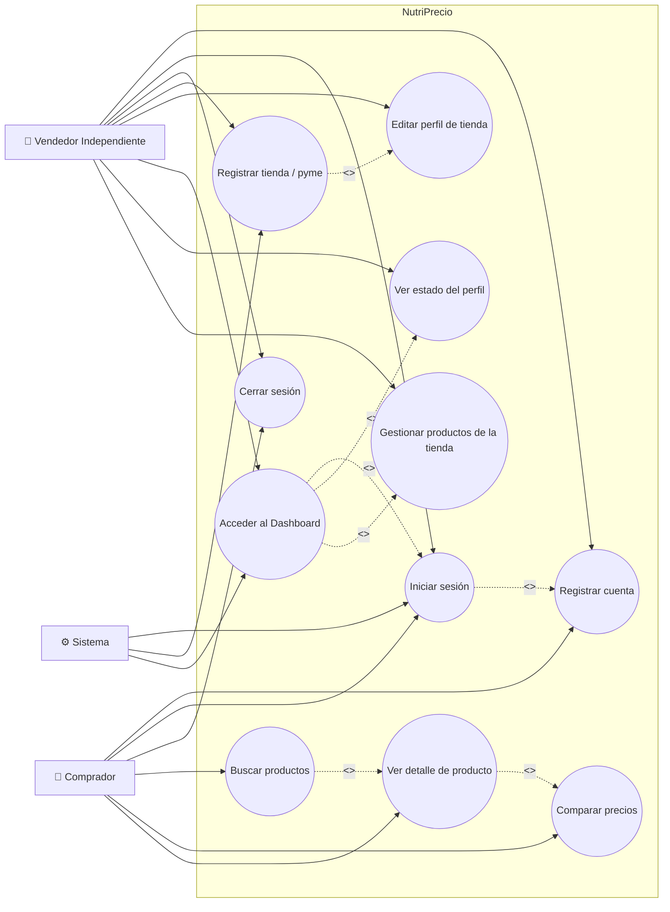

# Diagrama de Casos de Uso — NutriPrecio

## 1. Descripción

El diagrama de casos de uso representa las interacciones entre los actores del sistema y las funcionalidades definidas en el Sprint Backlog del proyecto NutriPrecio. Se identifican las acciones que cada tipo de usuario puede realizar dentro de la plataforma.

## 2. Actores

| Actor | Descripción |
|-------|-------------|
| **Comprador** | Usuario que se registra e inicia sesión en la plataforma para acceder a funcionalidades de búsqueda y comparación de productos saludables. (Referencia: MV-52) |
| **Vendedor Independiente** | Dueño de una tienda o pyme que registra su negocio, gestiona su perfil de tienda y administra sus productos desde un panel de control privado. (Referencia: MV-03, MV-54) |
| **Sistema** | El backend de NutriPrecio que gestiona la autenticación, la persistencia de datos y la lógica de negocio. |

## 3. Diagrama

## 4. Detalle de los Casos de Uso

### Historias de Usuario del Sprint

#### MV-03 — Registro de Tienda

> _"Como un vendedor independiente, necesito poder registrar mi tienda o pyme en la plataforma, con la finalidad de que los compradores sepan de mi existencia y cómo contactarme, y pueda mostrar mis productos en el portal."_

| Caso de Uso | Descripción |
|-------------|-------------|
| **Registrar tienda / pyme** | El vendedor completa un formulario con los datos públicos de su negocio (nombre, logo, sitio web). El sistema crea un perfil de tienda vinculado al usuario. |
| **Editar perfil de tienda** | El vendedor puede modificar la información pública de su tienda después del registro inicial. |

#### MV-52 — Login y Registro de Cuenta

> _"Como un futuro comprador, necesito un login, con la finalidad de poder crear mi cuenta para acceder a las funcionalidades que corresponden."_

| Caso de Uso | Descripción |
|-------------|-------------|
| **Registrar cuenta** | El usuario crea una cuenta proporcionando username, email y contraseña. El sistema encripta la contraseña y genera un token de sesión. |
| **Iniciar sesión** | El usuario se autentica con sus credenciales. El sistema valida y retorna un token de sesión. |
| **Cerrar sesión** | El usuario elimina su token de sesión del almacenamiento local. |

#### MV-54 — Panel de Control del Vendedor

> _"Como un vendedor independiente logueado, necesito acceder a un panel de control privado, con la finalidad de gestionar la información de mi tienda en un solo lugar."_

| Caso de Uso | Descripción |
|-------------|-------------|
| **Acceder al Dashboard** | El vendedor autenticado accede a su panel privado protegido por rutas protegidas (solo usuarios con rol vendedor). |
| **Ver estado del perfil** | Dentro del dashboard, el vendedor ve un mensaje de bienvenida y el estado actual de su perfil de tienda. |
| **Gestionar productos de la tienda** | El vendedor administra los productos asociados a su tienda desde el panel. |

### Casos de Uso Generales (derivados de la plataforma)

| Caso de Uso | Descripción |
|-------------|-------------|
| **Buscar productos** | El comprador busca productos saludables por nombre, marca o categoría. |
| **Ver detalle de producto** | El comprador ve la información completa de un producto con su precio más reciente. |
| **Comparar precios** | El comprador compara los precios de un producto en distintas tiendas. |

## 5. Relaciones

| Relación | Tipo | Descripción |
|----------|------|-------------|
| Registrar cuenta → Iniciar sesión | `<<include>>` | Para iniciar sesión, el usuario debe haberse registrado previamente. |
| Acceder al Dashboard → Iniciar sesión | `<<include>>` | El acceso al dashboard requiere autenticación previa. |
| Registrar tienda → Editar perfil | `<<extend>>` | Después de registrar la tienda, el vendedor puede opcionalmente editar su perfil. |
| Acceder al Dashboard → Ver estado del perfil | `<<extend>>` | Dentro del dashboard, el vendedor puede ver el estado de su perfil. |
| Acceder al Dashboard → Gestionar productos | `<<extend>>` | Dentro del dashboard, el vendedor puede gestionar sus productos. |
| Buscar productos → Ver detalle | `<<extend>>` | Desde los resultados de búsqueda, el comprador puede ver el detalle. |
| Ver detalle → Comparar precios | `<<extend>>` | Desde el detalle, el comprador puede comparar precios entre tiendas. |
