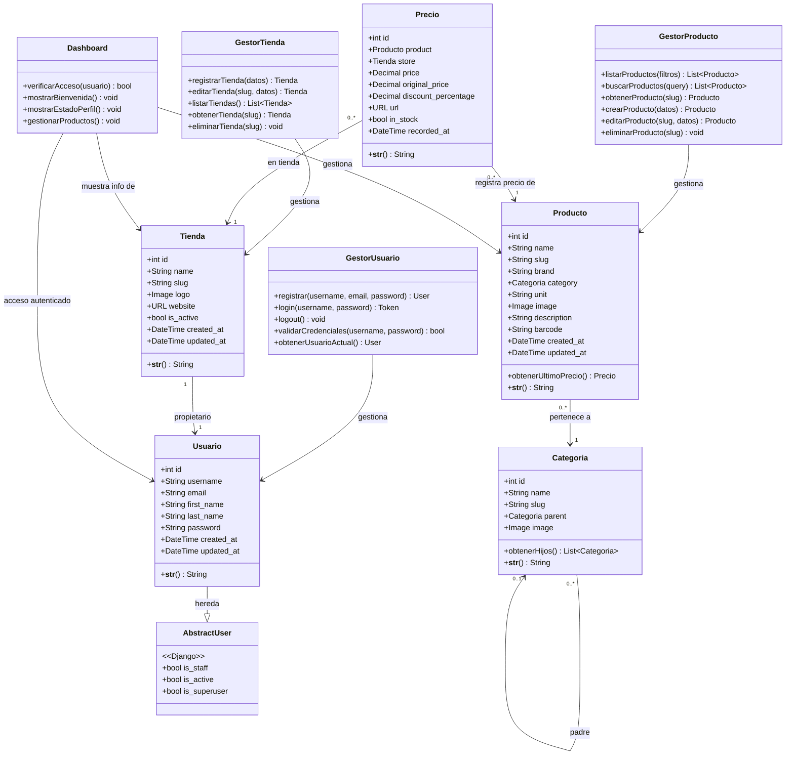

# Diagrama de Clases — NutriPrecio

## 1. Descripción

El diagrama de clases muestra la estructura estática del sistema NutriPrecio, representando las clases principales, sus atributos, métodos y las relaciones entre ellas. Está basado en los modelos de datos del backend Django y las funcionalidades definidas en el Sprint Backlog.

## 2. Diagrama de Clases Principal

## 3. Descripción de las Clases

### Clases de Entidad (Modelos de datos)

| Clase | Descripción | Referencia Sprint |
|-------|-------------|-------------------|
| **Usuario** | Representa un usuario del sistema (comprador o vendedor). Hereda de `AbstractUser` de Django. Agrega email único y timestamps. | MV-52: Configurar BDD para usuarios y encriptación de contraseñas. |
| **Tienda** | Representa una tienda o pyme registrada por un vendedor. Contiene nombre, slug, logo, sitio web y estado activo. | MV-03: Crear tabla en BDD para Perfiles de Tienda vinculada al usuario. |
| **Producto** | Representa un producto alimenticio del catálogo. Tiene nombre, marca, categoría, unidad de medida, imagen y código de barras. | Derivado de la funcionalidad de la plataforma. |
| **Categoria** | Representa una categoría de productos con soporte para jerarquías (padre/hijos). | Derivado de la funcionalidad de la plataforma. |
| **Precio** | Registro del precio de un producto en una tienda en un momento determinado. Permite historial de precios y comparaciones. | Derivado de la funcionalidad de la plataforma. |

### Clases de Control (Gestores)

| Clase | Descripción | Referencia Sprint |
|-------|-------------|-------------------|
| **GestorUsuario** | Maneja la lógica de registro, login, logout y validación de credenciales con tokens de sesión. | MV-52: Desarrollar lógica para validación de credenciales y tokens de sesión. |
| **GestorTienda** | Maneja las operaciones CRUD sobre tiendas. Incluye el endpoint para recibir y guardar información pública de la tienda. | MV-03: Crear endpoint para recibir y guardar información pública de la tienda. |
| **GestorProducto** | Maneja la búsqueda, listado y gestión de productos con filtros y paginación. | Derivado de la funcionalidad de la plataforma. |

### Clases de Interfaz

| Clase | Descripción | Referencia Sprint |
|-------|-------------|-------------------|
| **Dashboard** | Panel de control privado para vendedores. Verifica acceso autenticado, muestra bienvenida, estado del perfil, y permite gestión de productos. | MV-54: Configurar rutas protegidas; Diseñar Layout del Dashboard; Crear vista de Inicio. |

## 4. Relaciones entre Clases

| Relación | Tipo | Cardinalidad | Descripción |
|----------|------|--------------|-------------|
| `Usuario` → `AbstractUser` | Herencia | — | Usuario extiende el modelo base de Django, añadiendo email único y timestamps. |
| `Tienda` → `Usuario` | Asociación | 1 a 1 | Cada tienda está vinculada a un usuario propietario (vendedor). |
| `Producto` → `Categoria` | Asociación | Muchos a 1 | Cada producto pertenece a una categoría. |
| `Categoria` → `Categoria` | Auto-referencia | 0..* a 0..1 | Jerarquía padre-hijo para organizar subcategorías. |
| `Precio` → `Producto` | Asociación | Muchos a 1 | Cada registro de precio está asociado a un producto. |
| `Precio` → `Tienda` | Asociación | Muchos a 1 | Cada registro de precio está asociado a una tienda. |
| `GestorUsuario` → `Usuario` | Dependencia | — | El gestor manipula instancias de Usuario. |
| `GestorTienda` → `Tienda` | Dependencia | — | El gestor manipula instancias de Tienda. |
| `GestorProducto` → `Producto` | Dependencia | — | El gestor manipula instancias de Producto. |
| `Dashboard` → `Tienda`, `Producto`, `Usuario` | Dependencia | — | El dashboard presenta y gestiona información de estas entidades. |

## 5. Notas

- La clase `Precio` funciona como una tabla asociativa entre `Producto` y `Tienda`, añadiendo información temporal (`recorded_at`) que permite mantener un historial de precios.
- Los slugs (`SlugField`) en todas las entidades proporcionan URLs amigables para la navegación.
- La encriptación de contraseñas se maneja mediante `AbstractUser.create_user()` de Django (referencia MV-52).
- Las rutas protegidas del Dashboard (MV-54) se implementan mediante `authGuard` en el frontend y `IsAuthenticated` en el backend.

<!-- PLACEHOLDER: Si se agregan nuevas historias de usuario en futuros sprints (ej: favoritos, 
     notificaciones de precios, reseñas), agregar las clases correspondientes aquí. -->
